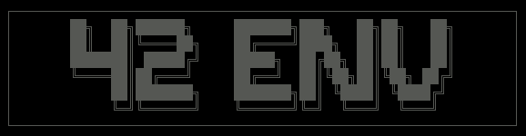
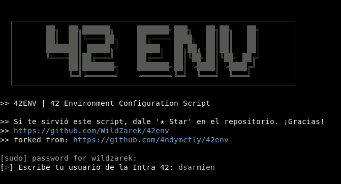
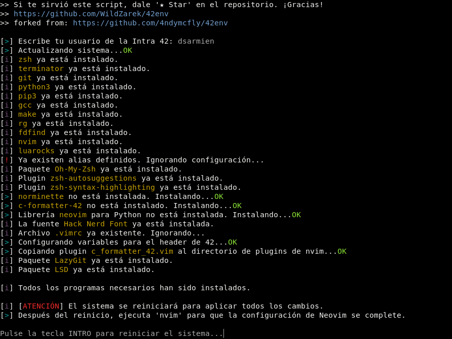
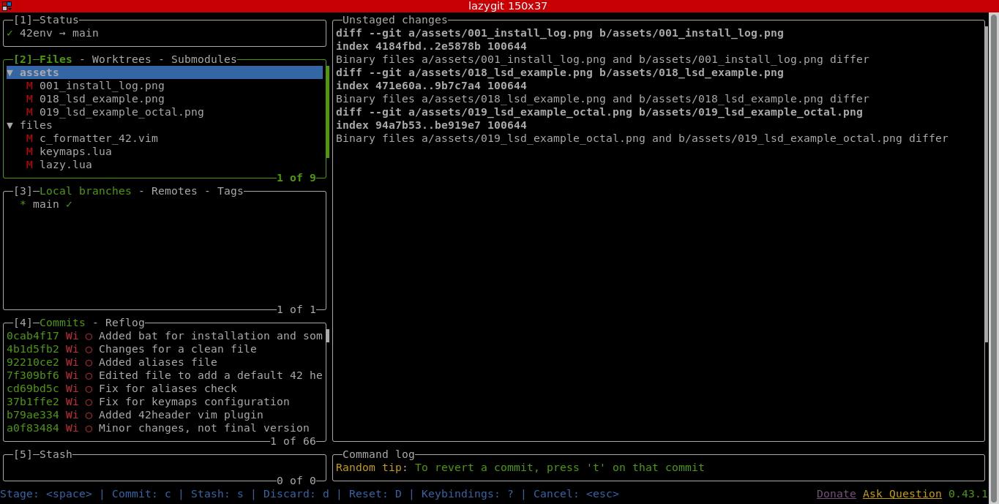

<div align="center">
  
  <p>42 ENVironment Configuration Script</p>
</div>

# Descripción

Automatiza la instalación y configuración del entorno básico necesario para programar en el Cursus de 42.<br>
Testeado en las siguientes distribuciones:

| Distribución                                                   | Codename      |
| ----------------                                               | ------------- |
| [Ubuntu 22.04 LTS](https://releases.ubuntu.com/jammy/)         | Jammy         |
| [Debian 12 LTS (WSL)](https://www.debian.org/releases/stable/) | Bookworm      |

# Importante

La ejecución de `42env.sh` en entornos basados en `WSL (Windows Subsystem for Linux)` actualmente da ciertos problemas relacionados con la instalación de <strong>'norminette'</strong> y <strong>'c_formatter_42'</strong> debido a que la instalación (en general) de paquetes con `pip/pip3` está limitada. La solución más simple es instalar `pipx` o bien crear un `virtualenv` desde el que instalar estos paquetes (lo cual es recomendable).
Luego es necesario incluir el directorio 'bin' del virtualenv en el PATH del sistema para que se pueda llamar a los binarios correspondientes desde fuera del mismo. Al finalizar la ejecución del script, en el momento que se nos pide reiniciar el sistema, también nos dará error si estamos bajo WSL, esto es debido a que no podemos hacer `sudo reboot` como haríamos normalmente en nuestra máquina virtual. La solución es tan simple como cerrar la instancia de WSL con el comando `exit` y volver a lanzar nuestra distro bajo WSL.

# Índice

1. [Software](#software)
2. [Recomendaciones](#recomendaciones)
3. [Instalación](#instalación)
4. [Durante la ejecución](#durante-la-ejecución)
5. [Extras](#extras)
    - [Oh-My-Zsh](#oh-my-zsh)
    - [zsh-autocompletions](#zsh-autocompletions)
    - [zsh-syntax-highlighting](#zsh-syntax-highlighting)
    - [LSD (LSDeluxe)](#lsd-lsdeluxe)
    - [BAT (batcat)](#batcat)
    - [LazyGit](#lazygit)
6. [En proceso...](#en-proceso)

# Software

Este script instala el siguiente software en el caso de que no esté instalado:

- **zsh |** [Shell ZSH](https://www.zsh.org/)
- **oh-my-zsh |** [Oh-My-Zsh](https://ohmyz.sh/)
- **zsh-autocompletions |** [Plugin zsh-autosuggestions](https://github.com/zsh-users/zsh-autosuggestions)
- **zsh-syntax-highlighting |** [Plugin zsh-syntax-highlighting](https://github.com/zsh-users/zsh-syntax-highlighting)
- **terminator |** [Terminator](https://gnome-terminator.org/)
- **git |** [Git Fast Version Control](https://git-scm.com/doc)
- **python3 |** [Python 3.11.2](https://www.python.org/downloads/release/python-3112/)
- **pip3 |** [Package Installer for Python](https://pip.pypa.io/en/stable/)
- **ripgrep |** [Recursively searches by regex pattern](https://github.com/BurntSushi/ripgrep)
- **fd / fd-find |** [Simply alternative to 'find'](https://github.com/sharkdp/fd)
- **luarocks |** [Package manager for Lua modules](https://luarocks.org/)
- **nerd fonts |** [Iconic font aggregator, collection, and patcher](https://www.nerdfonts.com/) | Hack Nerd Font
- **lsd |** [The next gen ls command](https://github.com/lsd-rs/lsd)
- **bat |** [A cat clone with wings](https://github.com/sharkdp/bat)
- **lazygit |** [Simple terminal UI for git commands](https://github.com/jesseduffield/lazygit)
- Atajos de teclado para 'nvim' y config para .zshrc

# Recomendaciones previas

**IMPORTANTE:** Antes de comenzar el proceso se recomienda hacer copia de seguridad o un snapshot del estado actual de la máquina virtual. Este script está pensado para uso en nuestro ordenador personal.

# Instalación

<div align="center">
  
</div>

Primero descargamos el repositorio y entramos en la carpeta 42env del repositorio clonado.

```bash
git clone https://github.com/WildZarek/42env.git ; cd 42env
```

Asigna permisos de ejecución al script y ejecútalo. Se recomienda tener siempre maximizada la ventana de la shell.

```bash
chmod +x 42env.sh ; ./42env.sh
```
<div align="center">
  
</div>

# Durante la ejecución

Al ejecutar el script, te pedirá tu usuario de la Intra 42, escríbelo y pulsa `Enter`<br>
Este usuario se usará para configurar el header de 42 para vim/nvim.

Una vez que haya terminado todo el proceso, pulsa la tecla `Enter` y se reiniciará el equipo.<br>
Después de arrancar el sistema, abre Terminator, maximiza la ventana y ejecuta `nvim`

```bash
nvim
```

Si no pulsas con el ratón en la ventana de instalación, puede que el instalador te pida que pulses una tecla.<br>
Si es tu caso, pulsa la tecla `Espacio`. La configuración continuará y finalizará cuando te solicite que pulses `Enter`.

# Extras

## Oh-My-Zsh

> Pendiente de redactar esta sección...

## zsh-autocompletions

> Pendiente de redactar esta sección...

## zsh-syntax-highlighting

> Pendiente de redactar esta sección...

## LSD (LSDeluxe)

Se decidió incluir LSD ya que mejora la legibilidad en la terminal aprovechando las <strong>Hack Nerd Fonts</strong> instaladas. El alias `ll` equivale a:

```bash
/usr/bin/lsd -lha --group-dirs=first
```


Si por comodidad queremos ver los permisos de los archivos y carpetas en base octal, `llo` es un alias de:

```bash
/usr/bin/lsd -lha --group-dirs=first --permission octal
```


## BAT (batcat)

> Pendiente de redactar esta sección...

## LazyGit

LazyGit es ideal para quienes prefieren usar la terminal pero quieren una forma más cómoda y rápida de manejar Git sin tener que escribir todos los comandos manualmente. Resulta especialmente útil para desarrolladores que trabajan con repositorios grandes y complejos, ya que facilita la visualización de los cambios y permite moverse ágilmente entre las distintas secciones del repositorio.

> ¡Por probarlo no pierdes nada!

<div align="center">
  
</div>

# Terminal

## Terminator
<div align="center">
  
</div>

<strong>Terminator</strong> es una excelente opción si buscas un emulador de terminal que combine velocidad, personalización y funcionalidad avanzada, ideal para usuarios que desean aprovechar al máximo su entorno de trabajo en la terminal. Permite dividir la pantalla en varias terminales dentro de una misma ventana, facilitando la multitarea sin necesidad de usar múltiples ventanas. Terminator es un proyecto de código abierto con un desarrollo activo, lo que significa que recibe actualizaciones frecuentes y mejoras continuas.

## Atajos de teclado:

| Atajo | Descripción |
| --- | --- |
| `Ctrl` + `Shift` + `Q` | Finaliza la ejecución de Terminator |
| `Ctrl` + `Shift` + `W` | Cierra la terminal o la ventana activa |
| `Ctrl` + `Shift` + `I` | Abre una nueva ventana (la cual es parte del proceso actual de Terminator)
| `Ctrl` + `Shift` + `T` | Abre una nueva pestaña en el directorio actual |
| `Ctrl` + `Shift` + `O` | Divide la terminal horizontalmente |
| `Ctrl` + `Shift` + `E` | Divide la terminal horizontalmente |
| `Ctrl` + `Shift` + `→` | Modifica el tamaño de la terminal verticalmente |
| `Ctrl` + `Shift` + `←` | Modifica el tamaño de la terminal verticalmente |
| `Ctrl` + `Shift` + `↑` | Modifica el tamaño de la terminal horizontalmente |
| `Ctrl` + `Shift` + `↓` | Modifica el tamaño de la terminal horizontalmente |
| `Ctrl` + `Shift` + `S` | Oculta/Muestra la barra de scroll de la terminal activa |
| `Ctrl` + `Shift` + `F` | Muestra la barra de búsqueda |
| `Ctrl` + `Shift` + `N` | Cambia a la siguiente terminal en la misma pestaña |
| `Ctrl` + `Shift` + `P` | Cambia a la anterior terminal en la misma pestaña |
| `Ctrl` + `Shift` + `X` | Cambia entre mostrar todas las terminales o maximizar la actual |
| `Ctrl` + `Shift` + `Z` | Cambia entre mostrar todas las terminales o una visión ampliada de la actual (zoom) |
| `Ctrl` + `PageDown` | Cambia a la siguiente terminal |
| `Ctrl` + `PageUp` | Cambia a la terminal anterior |
| `Alt` + `→` | Cambia a la terminal justo a la derecha de la actual |
| `Alt` + `←` | Cambia a la terminal justo a la izquierda de la actual |
| `Alt` + `↑` | Cambia a la terminal justo encima de la actual |
| `Alt` + `↓` | Cambia a la terminal justo debajo de la actual |
| `Ctrl` + `Shift` + `C` | Copia el texto seleccionado a la clipboard |
| `Ctrl` + `Shift` + `V` | Pega el contenido de la clipboard a la terminal actual |
| `Ctrl` + `Plus` (+) | Aumenta el tamaño de la fuente para la terminal actual (es posible que debas presionar `Shift` dependiendo del teclado) |
| `Ctrl` + `Minus` (-) | Reduce el tamaño de la fuente para la terminal actual (es posible que debas presionar `Shift` dependiendo del teclado) |
| `Ctrl` + `Zero` (0) | Reinicia el tamaño de la fuente para la terminal actual (a los valores de configuración por defecto) |
| `F11` | Activa o desactiva la pantalla completa |
| `Ctrl` + `Shift` + `R` | Reinicia el estado de la terminal |
| `Ctrl` + `Shift` + `G` | Reinicia el estado de la terminal y limpia la pantalla |

# En proceso...
Próximamente intentaré publicar el proyecto con una configuración alternativa para su ejecución en usuarios con permisos limitados.

> ##### Si consideras útil este proyecto, apóyalo haciendo "★ Star" en el repositorio. ¡Gracias!

# ¡Happy hacking & coding! 😎

[Volver al índice](#índice)